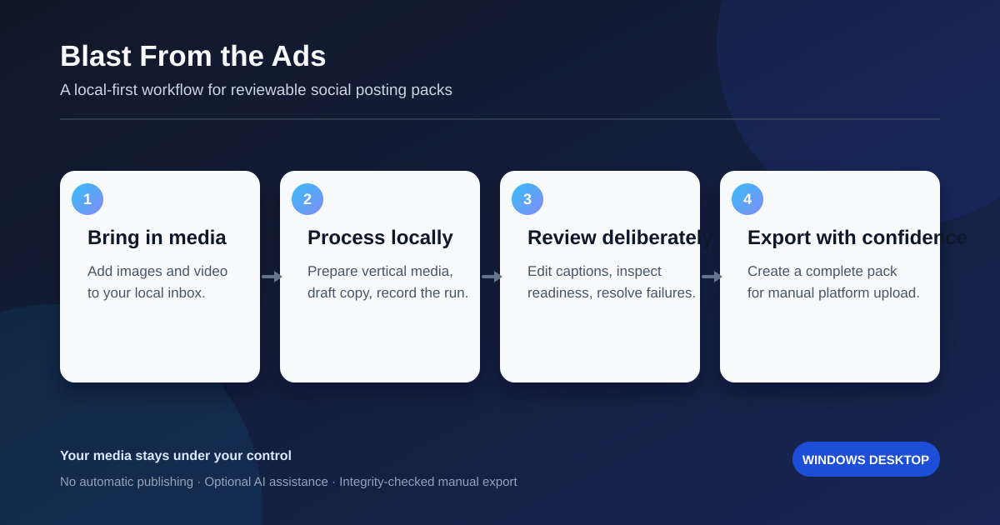

# Blast From the Ads

[](https://github.com/wizkidword/blast-from-the-ads-poster/actions/workflows/unit-tests.yml)

**A local Windows desktop workflow for turning ad media into reviewable, platform-ready social posting packs.**

Bring in images or video, create tailored draft copy, review the result, and export an integrity-checked pack for manual posting. The app helps organize the work; it does **not** publish to social platforms on your behalf.



## What it does

1. **Bring in media** — add images or video to a local inbox.
2. **Process locally** — prepare vertical media, build a post workspace, and optionally create AI-assisted copy.
3. **Review deliberately** — edit captions, check platform readiness, resolve failures, and mark work ready only when you choose.
4. **Export with confidence** — create a posting pack with hashes, media details, and platform notes for manual upload.

## Designed for control

- **Local-first workflow:** your inbox, working files, captions, and export packs stay on your Windows machine.
- **AI is optional:** disable it to create editable local drafts without an API key. When enabled, the app sends only bounded analysis copies to the configured provider.
- **Manual publishing:** there is no background publishing or social-account connection.
- **Safer media handling:** preflight checks, private staging, workspace locks, run ledgers, and recovery tools help protect active work.
- **Verifiable handoffs:** posting packs include an integrity manifest, file hashes, and platform-specific validation notes.

## Quick start

**You need:** Windows 10 or 11, Python 3.13, and FFmpeg/FFprobe available on `PATH` for real media processing.

```powershell
Copy-Item .env.example .env
Copy-Item settings.example.json settings.json
.\Launch-Blast-From-The-Ads.bat
```

Add an `OPENAI_API_KEY` to `.env` only if you want AI-assisted analysis. To run entirely locally, set `ai_analysis_enabled` to `false` in `settings.json` (or set `SKIP_AI_ANALYSIS=true` in `.env`).

For an isolated development setup, tests, and the reproducible Windows package build, see [DEVELOPMENT.md](DEVELOPMENT.md).

## Everyday workflow

| Stage | What happens |
| --- | --- |
| Process | The desktop app inspects media, prepares output, and records the run. |
| Review | Edit copy, inspect readiness results, and retry only the files that failed. |
| Ready | A shared checklist validates captions and actual media against the chosen platform profile. |
| Export | Create a complete, integrity-checked folder for a human to upload. |

Each completed post receives its own workspace under `outputs/`, including its manifest, canonical caption, prepared media, and state. Caption exports and processed-media folders can be configured in your ignored `settings.json`; leave them blank to use the local defaults.

## Privacy and AI

AI analysis is opt-in and is never a requirement for processing. With it enabled, Blast From the Ads prepares lower-resolution, bounded copies for analysis and records where each draft came from (vision, fallback, manual, or later edit). `store: false` requests that the provider not retain a response, but the request is still an online provider request. See [DEVELOPMENT.md](DEVELOPMENT.md) for the operational details.

Do not commit `.env`, `settings.json`, source media, generated outputs, logs, or posting packs. The repository includes safe templates instead.

## Documentation

- [Development and verification](DEVELOPMENT.md)
- [Release history](CHANGELOG.md)
- [V3 workstation roadmap](docs/plans/v3-roadmap.md)
- [V4 desktop UI roadmap](docs/plans/v4-gui-ui-roadmap.md)
- [Contributing](CONTRIBUTING.md)
- [Security policy](SECURITY.md)

## Build and verification

The repository includes a repeatable Windows packaging path. `Verify-Release.bat` runs the tests, compile checks, build, headless EXE smoke test, and package-secret check. Successful builds generate SHA-256 checksums and an SPDX SBOM in `dist/release-metadata/`.

```powershell
.\.venv\Scripts\python.exe -m unittest discover -s tests
cmd /c Verify-Release.bat
```

The GitHub Actions workflow runs the unit suite and rebuilds the Windows executable from the pinned Python 3.13 dependency lock.

## Project status

Blast From the Ads is a Windows desktop tool for a deliberate, review-first content workflow. Features and safeguards are documented in the changelog and roadmaps; contributions that keep the workflow local, inspectable, and compatible are welcome.

## License

No license has been selected for this repository yet. Do not assume permission to reuse or redistribute the code until a license is added.
